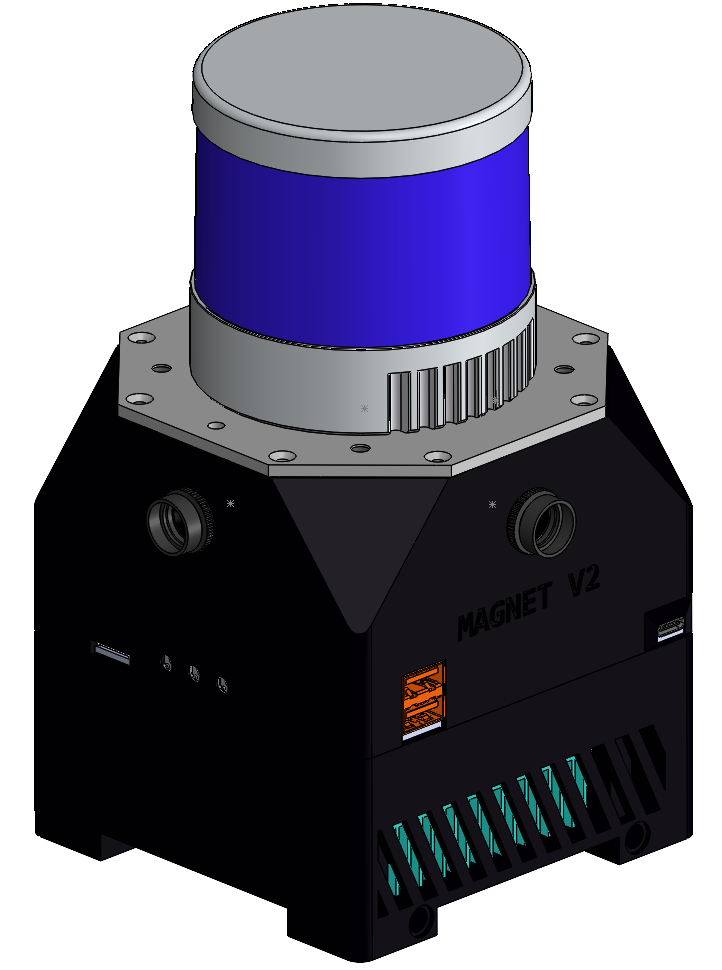

# magnet_v2_description



This package contains a **URDF Xacro description of the Magnet V2**, a mapping device consisting of a Hesai QT64/Pander XT32, a Microstrain GX5-AR, 3 E-con global shutter cameras and a Jetson Orin AGX Dev Kit.

This package requires the `microstrain_inertial_description` as well as `xacro` which can be installed with:

```bash
$ sudo apt-get install ros-$ROS_DISTRO-microstrain-inertial-description ros-$ROS_DISTRO-xacro
```

or alternatively automatically through `rosdep`: 

```bash
$ rosdep install --from-paths src --ignore-src -r
```


For visualizing the URDF with RViz launch:

```bash
$ ros2 launch magnet_description visualize.launch.py
```

